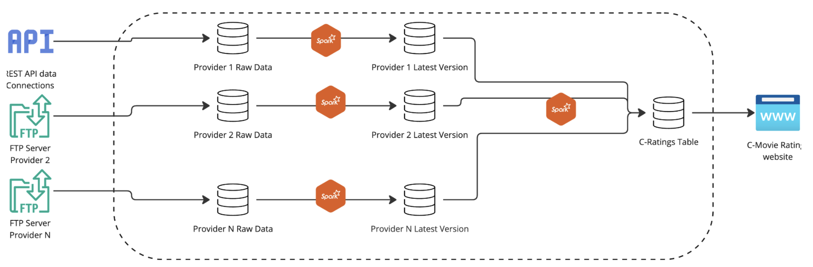

# C-Movie Rating Platform Solution

## Intro

C-Movie plans to create a platform that aggregates film ratings data from various different platforms into one single web. C-Movie adds value to users by creating a new custom rating, divided into 3 categories (performance, screenplay, soundtrack) to its users, but taking into account all the platforms of the providers that have the film listed. These providers are also film, series and documentary rating platforms, and C-Movie uses their data in order to create a common portal where the best information of all the different providers is used in order to catalog and rate films. These providers are such as Filmaffinity, RottenTomatoes, IMDb, etc… 
Assumptions and constraints used in the solution.

1. This document will be speaking and referring to the “platform”. This can be a cloud platform or an on-premises facility, what matters is that it will be the place where the data is stored and processed.

2. Providers only provide data through one medium (Being it REST API, (S)FTP server(s), other mediums every provider has just one way of sending or exposing data)

3. In order to get the web working, an initial load of historical data has to be performed. This means, the providers should specifically provide all the historical data to C-Movie’s technical team in order to create the initial database to start working. This historical data loads can be done through the same means, meaning that if a provider’s data is normally fetched through a REST API, historical data will be loaded from there, If data is taken from a FTP server, all the historical files should be there when the solution is run for the first time. Loading historical data of films is not a big deal since there is not a provider in existence with more than 1 million records currently (checked filmaffinity and IMDb, see in [Wikipedia](https://en.wikipedia.org/wiki/IMDb))
This solution is platform and service agnostic. This means that there is no specific database, orchestration tool or cloud platform that will be mentioned here in order to preserve the possibility of implementing the solution anywhere and choosing this services or tools before (It is only needed to know conceptually what the tools involved in the design need to do)
Original Data has to be persisted as is, this means, data will be fetched from the providers and stored as it is without further cleaning, modification, etc… So that reprocessing all the data is always possible from the first ingestion timestamp onwards. This will be the landing zone.
4. It will be necessary to perform upserts on every different provider data. This means that film ratings are going to be constantly updated, maybe not for films produced before 1980, but modern films constantly receive new ratings and updates, so the workflow should be able to update the data belonging to a film that was originally ingested into C-Movie’s platform some time ago. A CDC framework is going to be used in order to do this UPSERTS/ UPDATES with no effort. This point is crucial in the design, for example, see here how IMDb updates their records daily https://datasets.imdbws.com/ The platform will have a directory specific per provider.

5. There is some kind of method or information that allows the platform to distinguish when a film is old (It is already present in the dataset) or new, or, in other words, when the provider is sending updated data or when the provider is sending new data. 
The C-Rating algorithm is able to calculate all the data with data coming from just one provider or more.
6. There is a way to distinguish between the film original name and the title that is more commonly used, in order to do the comparison between platforms titles should match. F.e, IMDb provides this information separately.

## Functional Design /  High level picture of the proposal

This is the functional workflow of the solution, this pipeline will be scheduled and triggered with a specific frequency, for example, every 12 hours. This workflow is valid for all the stages of the application (initial load, normal functioning status and when the different provider’s data updates stop and the only thing left is the C-Ratings table and web application)

1. Data is fetched from the various different data sources and put into the platform. These processes can run on a scheduled mode or can be triggered. It doesn't really matter since  what is important is that every time the C-Rating calculator is run the latest data is available to be used. Therefore, the idea is to fetch all the data at the beginning of the pipeline in a parallel manner. The data fetched from every different provider will be stored as is in a bucket/ directory separated from the other providers. This functionality will be deployed on a serverless application that has scalable memory and compute power, so that it can process low and big amounts of data

2. Data will be updated for every different provider. There will be 2 different buckets per provider, one with all the data as is and one with the data as the C-Rating calculator needs it. So, from the landing bucket to the usable bucket, an upsert spark job process will be performed using Apache Hudi or Apache Iceberg. This CDC framework allows the process to be very cost effective, since it only processes new data and does not read the full dataset in order to perform operations. For every film present in the new data, it will be a timestamp and the type of film it is (New Film = INSERT, Old Film = UPSERT and there is also the possibility to delete films, DELETE) All the records for every different provider will contain a last_updated timestamp column, this will allow the C-Rating Spark Job to know when to recalculate the ratings for a specific film or not, this way, a lot of time will be save in terms of doing calculations. The output fields will be homogeneous per provider, and these fields will be:

Important: The film title has to be normalized to lower case, no special characters, no spaces.

3. Once the latest data is updated for all the providers, a spark job will be triggered in order to update the C-Ratings table. The id will be assigned in this process (Already processed films will already have an id and their data will be updated and new films will be assigned an id during the process) There is no way (and no need to) of standardising the id before the moment the datasets belonging to the different providers are combined in order to generate or update this table, also because every different provider will be using their own ids. In order to generate the id, a simple counter with a preceding character is sufficient, for example: ‘m000000001’.
C-Ratings table is exposed through an API to the web application and it will be used to perform the basic functionalities in the platform, for the MVPm just the basic title search and rating display. The user interaction with the app is read only, so there is no need to provide any extra functionality to the database in order to enable external edits. The columns available in this table are:

All the process will be orchestrated using a tool that enables the platform to do so. Tools available in the market are Dagster, Airflow. There are also some cloud native solutions or even free event based tools (These will fit under very clear circumstances only) The process can be scheduled to be run twice a day. Increasing this frequency makes no sense at all since availability of data is not crucial in time-consuming terms. Reducing the frequency to just one daily run is also a very valid option.

## Proposed Architecture

Taking all of the above into account, a generalistic approach with which this solution can be implemented should be similar to the following one:

